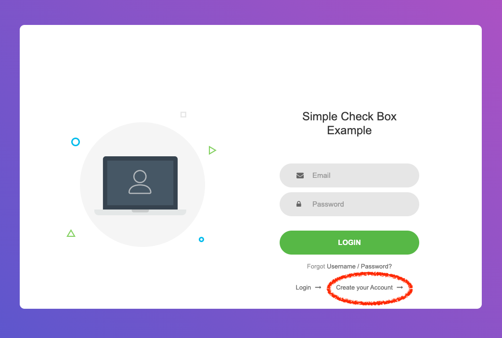

User and collaboration =====

Sign up and log in \-\-\-\-\-\-\-\-\-\-\--Potato supports
self-registration by default. A new user can register for the annotation
task by navigating to the annotation server, then selecting \"Create
your account\".

{.align-center
width="400px"}

After creating an account, you can log in with the email and password
used in the account creation step.

Direct login with URL arguement \-\-\-\-\-\-\-\-\-\-\--

{.align-center
width="1000px"}

Potato also supports direct login through URL arguements, for example:
<http://localhost:8000/?PROLIFIC_PID=user>

You could setup direct login in the YAML configuration file
([example](https://github.com/davidjurgens/potato/blob/master/example-projects/match_finding/configs/match_finding.yaml#L48)):

``` YAML
#defining the ways annotators entering the annotation system
"login": {
   "type": 'url_direct',    #can be 'password' or 'url_direct'
   "url_argument": 'PROLIFIC_PID' # when the login type is set to 'url_direct', 'url_argument' must be setup for a direct url argument login
},
```

Collaboration under local network \-\-\-\-\-\-\-\-\-\-\-\-\-\-\--If you
do not want to expose the annotation app globally, Potato serves to the
local area network by default. You can access the Potato instance
through the local IP address of the server.

On Linux machines, you can determine the local IP by running

``` bash
hostname -I
```
